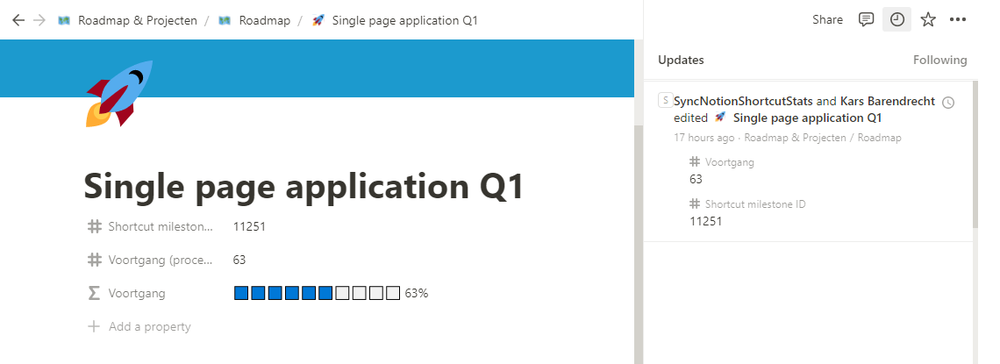

# sync-notion-shortcut-stats


Sync Notion Database properties with Shortcut milestone progress;
- gets shortcut milestoneId's from specified Notion properties
- gets the progress of the milestone from Shortcut
- updates the notion page
---

#### Running on Github Actions
Add the following code into your workflow steps:
```yml
- name: Sync Notion/Shortcut milestone progress
  uses: ScientaNL/sync-notion-shortcut-stats@0.0.3
  with:
    SHORTCUT_TOKEN:"YOUR_SHORTCUT_API_TOKEN" # e.g. LIpl2fXc-VT9E-CuRH-5YkQ-LuC1VF7FhHA3
    NOTION_TOKEN:"YOUR_NOTION_API_TOKEN" # e.g. secret_CzUpkzF13wggns5OnXvz8ryPHqEzIZqgXxqmhMqlf4c
    NOTION_DATABASE_NAME:"YOUR_NOTION_DATABASE_NAME" # e.g. 'Roadmap'
    NOTION_DATABASE_PROPERTY_MILESTONE:"YOUR_NOTION_DATABASE_PROPERTY_MILESTONE" # e.g. 'Shortcut milestone ID'
    NOTION_DATABASE_PROPERTY_PROGRESS:"YOUR_NOTION_DATABASE_PROPERTY_PROGRESS" # e.g 'Progress (percent)'
```
---

#### Running local
Provide and `.env` which looks like the `.env.template`

then run
```bash
npm run build
node ./dist/index.js
```
---

### Progress bar: Notion formula
To show a progress bar you can hide the property with the percentage, and create an additional property with type `formula` and add in this formula (Do correct the property name)
```notion
if(empty(prop("Voortgang (procent)")), "⬜️⬜️⬜️⬜️⬜️⬜️⬜️⬜️⬜️⬜️ 0%", replaceAll(slice("xxxxxxxxxx", 0, floor(prop("Voortgang (procent)") / 100 * 10)), "x", "🟦") + replaceAll(slice("xxxxxxxxxx", 0, ceil(-1 * prop("Voortgang (procent)") / 10)), "x", "⬜️") + " " + format(prop("Voortgang (procent)")) + "%")
```
